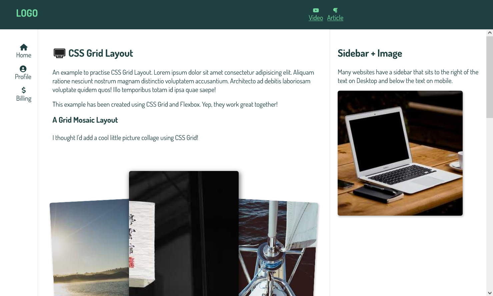

# Grid-Layout-H-Grail

Classic Layout which consists of a header, a main content area with fixed-width navigation on the left, content in the middle and a fixed-width sidebar on the right and then a footer.

Classic layout for websites imlemented using CSS Grid.

Build Purpose: To practise CSS Grid.

## Preview

### Personal Notes

- Learnt CSS Grid properties
- Grid made easy using 'grid-template-areas' property
- Came to know about 'last-of-type' pseudo element.
- 'overflow-y: scroll"
